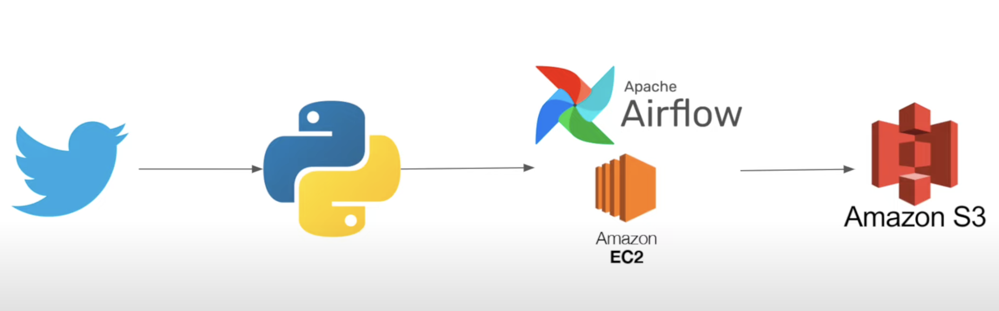

# TWITTER AIRFLOW DATA PIPELINE

Design Diagram :
----------------

Folder Structure :
------------------
    |- readme.md
    |- twitter_apiData.py
    |- twitter_csvData.py
    |- twitter_dag.py
    |- data
        |- rawdata.csv
        |- cleandata.csv

Process :
----------
1. Data is read from twitter API/ CSV data downloaded from kaggle
2. Data is cleaned and stored to cleandata.csv file
3. Data extraction and cleaning script is embedded in function run_twitter_etl()
4. Airflow Dag is defined and calls run_twitter_etl() function

Script Files :
--------------

- twitter_apiData.py 
                 - code to access twitter API and download tweeets data
                 - transform and clean the data 
                 - convert and save the dataset from JSON -> CSV
                 -  save the cleaned dataset to cleandata.csv

- twitter_csvData.py
                 -  script to transform and clean the dataset downloaded from kaggle
                 -  the data is cleaned by removing rows that have null values for username and text
                 -  Update the index so that it starts from 1
                 -  save the cleaned dataset to cleandata.csv
- twitter_dag.py
                 - Airfolw dag scripts

